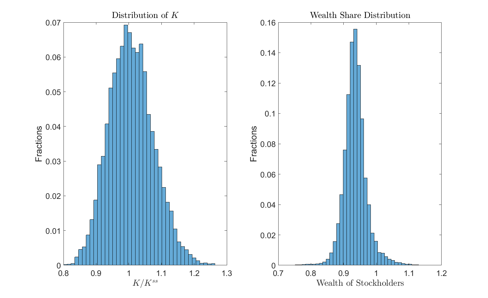

*****************************************************************
Guvenen (2009): Asset Pricing with Heterogeneous IES
*****************************************************************

`Guvenen (2009) <https://onlinelibrary.wiley.com/doi/abs/10.3982/ECTA6658>`_ constructs a two-agent model to account for several
salient features of asset pricing moments, such as high risk premium,
low and relatively smooth interest rate, and countercyclical movements
in risk premium and Sharpe ratio. The two key ingredients of his model
are limited stock market participation and heterogeneity in the elasticity
of inter-temporal substitution in consumption (EIS).

When all endogenous states are pre-determined, such as capital and bond share in the current example, the expectation of future
variables can be parameterized and integrated before solving the system of equilibrium equations, which greatly speeds up the computation.
We illustrate how to use parameterized expectation with the toolbox in this example.

.. _Guvenen2009:
================
The Model
================

There are two types of infinitely-lived agents: stockholders
(:math:`h`) with measure :math:`\mu`, and non-stockholders (:math:`n`) with
measure :math:`1-\mu`. Agents have Epstein-Zin utility functions 

.. math::

    U_{i,t}=\left\{ \left(1-\beta\right)c_{i,t}^{1-\rho^{i}}+\beta\left[\mathbb{E}_{t}\left(U_{i,t+1}^{1-\alpha}\right)\right]^{\frac{1-\rho^{i}}{1-\alpha}}\right\} ^{1/\left(1-\rho^{i}\right)}.\label{eq:utility Guv}

for :math:`i=h,n`. Most importantly, :math:`\rho^{h}<\rho^{n}`, i.e., the non-stockholders
have lower EIS which is inversely proportional to :math:`\rho^{i}`, and
thus they have higher desire for consumption smoothness over time. Each agent
has one unit of labor endowment.

Stockholders can trade stock :math:`s_{t}` and bond :math:`b_{h,t}` at prices
:math:`P_{t}^{s}` and :math:`P_{t}^{f}` respectively. Their budget constraint
is 

.. math::

    c_{h,t}+P_{t}^{f}b_{h,t+1}+P_{t}^{s}s_{t+1}\leq b_{h,t}+s_{t}\left(P_{t}^{s}+D_{t}\right)+W_{t},

where :math:`W_t` is the labor income and borrowing constraint is 

.. math::

    b_{h,t+1}\geq-\underline{B},

and in calibration :math:`\underline{B}` is set to six times of the average
monthly wage rate. The non-stockholders have the same constraints.
In addition, they are restricted from trading stocks.

A representative firm produces the consumption good using capital
:math:`K_{t}` and labor :math:`L_{t}` based on a Cobb-Douglas production function:

.. math::

    Y_{t}=Z_{t}K_{t}^{\theta}L_{t}^{1-\theta},

and the technology evolves according to an AR(1) process: 

.. math::

    \ln Z_{t+1}=\phi\ln Z_{t}+\varepsilon_{t+1},\text{ }\varepsilon\overset{i.i.d.}{\sim}N\left(0,\sigma_{\varepsilon}^{2}\right).

The firm maximizes its value :math:`P_{t}^{s}` expressed as the sum of
its future dividends :math:`\left\{ D_{t+j}\right\} _{j=1}^{\infty}` discounted
by the shareholders' marginal rate of substitution process:

.. math::

    P_{t}^{s}=\max_{\left\{ I_{t+j},L_{t+j}\right\} }\mathbb{E}_{t}\left[\sum_{j=1}^{\infty}\beta^{j}\frac{\Lambda_{h,t+j}}{\Lambda_{h,t}}D_{t+j}\right]. 

The firm accumulates capital subject to a concave adjustment cost
function in investment:

.. math::

    K_{t+1}=\left(1-\delta\right)K_{t}+\varPhi\left(\frac{I_{t}}{K_{t}}\right)K_{t}. 

Each period, the firm sells one-period bonds at price :math:`P_{t}^{f}`.
The bond supply is constant and equals to :math:`\chi` fraction of its
average capital stock :math:`\bar{K}`. Thus dividend :math:`D_{t}` can be written
as 

.. math::

    D_{t}=Z_{t}K_{t}^{\theta}L_{t}^{1-\theta}-W_{t}L_{t}-I_{t}-\left(1-P_{t}^{f}\right)\chi\bar{K}.

A sequential competitive equilibrium is given by sequences of allocations
:math:`\{c_{i,t},b_{i,t+1},s_{t+1},I_{t},K_{t+1},L_{t}\}`
:math:`i=h,n` and prices :math:`\left\{ P_{t}^{s},P_{t}^{f},W_{t}\right\}`
such that (i) given the price sequences, :math:`\left\{ c_{i,t},b_{i,t+1},s_{t+1}\right\}`
:math:`i=h,n` solve the stockholders' and non-stockholders' optimization
problems; (ii) Given the wage sequence :math:`\left\{ W_{t}\right\}` and
the law of motion for capital, :math:`\left\{L_{t},I_{t}\right\}`
are optimal for the representative firm; (iii) all markets clear:

.. math:: 

    \mu b_{h,t+1}+\left(1-\mu\right)b_{n,t+1} & =\chi\bar{K},\label{eq:MC bond Guv}\\
    \mu s_{t+1} & =1,\label{eq:MC stock Guv}\\
    L_{t} & =1,\nonumber \\
    \mu c_{h,t}+\left(1-\mu\right)c_{n,t}+I_{t} & =Y_{t}.\nonumber 

We compute a recursive equilibrium using :math:`\left\{ K_{t},B_{t}^{n},Z_{t}\right\}`
as the aggregate state variables, where :math:`B_{t}^{n}=\left(1-\mu\right)b_{n,t}`
is total bond holding by the non-stockholders. We have :math:`8` unknowns:
{:math:`c_{h,t}`, :math:`c_{n,t}`, :math:`I_{t}`, :math:`B_{t+1}^{n}`, :math:`\lambda_{h,t}`, :math:`\lambda_{n,t}`, :math:`P_{t}^{s}`, :math:`P_{t}^{f}`},
and the :math:`8` equations used to solve them are:

- Euler equations for bond holding:

.. math::

    P_{t}^{f}=\beta\left(1+\lambda_{i,t}\right)\mathbb{E}_{t}\left(\frac{\Lambda_{i,t+1}}{\Lambda_{i,t}}\right),\text{ }\forall i=h,n.

- Euler equations for the stockholders' demand of equity:

.. math::

    P_{t}^{s} =\beta\mathbb{E}_{t}\left[\frac{\Lambda_{h,t+1}}{\Lambda_{h,t}}\left(P_{t+1}^{s}+D_{t+1}\right)\right].

- Slackness condition of borrowing limit:

.. math::

    \lambda_{i,t}\left(b_{i,t+1}+\underline{B}\right)=0,\text{ }\forall i=h,n.

- The budget constraints (imposing :math:`s_{t+1}=1/\mu`):

.. math::

    c_{h,t}+P_{t}^{f}b_{h,t+1}+\frac{P_{t}^{s}}{\mu}=P_{t}^{s}+D_{t}+\frac{\chi\bar{K}-B_{t}^{n}}{\mu}+W_{t},

.. math::

    c_{n,t}+P_{t}^{f}b_{n,t+1}=\frac{B_{t}^{n}}{1-\mu}+W_{t}.

- Firm's optimal capital accumulation :math:`K_{t+1}`:

.. math::

    q_{t} =\beta\mathbb{E}_{t}\left\{ \frac{\Lambda_{h,t+1}}{\Lambda_{h,t}}\left[\theta Z_{t}K_{t}^{\theta-1}-\frac{I_{t+1}}{K_{t+1}}+q_{t+1}\left(1-\delta+\varPhi\left(\frac{I_{t+1}}{K_{t+1}}\right)\right)\right]\right\} ,\label{eq:capital price Guv}

in which capital price :math:`q_{t}` is the Lagrangian multiplier on the
capital formation equation and satisfies

.. math::

    q_{t}\varPhi^{\prime}\left(\frac{I_{t}}{K_{t}}\right)=1.\label{eq:optimal inv Guv}

The auxiliary variables can be determined by the utility function, market clearing conditions, and the following two equations:

.. math::

    W_{t}= \left(1-\theta\right)Z_{t}\left(\frac{K_{t}}{L_{t}}\right)^{\theta},

.. math::

    \beta\frac{\Lambda_{i,t+1}}{\Lambda_{i,t}} =\beta^{\frac{1-\alpha}{1-\rho^{i}}}\left(\frac{c_{i,t+1}}{c_{i,t}}\right)^{-\rho^{i}}\left[\frac{\frac{U_{i,t+1}}{c_{i,t}}}{\left[\left(\frac{U_{i,t}}{c_{i,t}}\right)^{1-\rho^{i}}-(1-\beta)\right]^{1/\left(1-\rho^{i}\right)}}\right]^{\rho^{i}-\alpha}.

In period :math:`t`, the 6 future variables in use: :math:`c_{h,t+1}`, :math:`c_{n,t+1}`, :math:`P_{t+1}^{s}+D_{t+1}`,
:math:`I_{t+1}/K_{t+1}`, :math:`U_{h,t+1}` and :math:`U_{n,t+1}` are functions of
:math:`\left\{ K_{t+1},B_{t+1}^{n},Z_{t+1}\right\}` and are solved from
the previous iteration. Similar to `Guvenen (2009) <https://onlinelibrary.wiley.com/doi/abs/10.3982/ECTA6658>`_, the initial
guesses for these functions are obtained by solving a version of the model with no leverage.

========================================
The gmod File
========================================

The model can be solved with the following :download:`guvenen2009.gmod <guvenen2009.gmod>` file (you also need :download:`tauchen.m <tauchen.m>`)

.. literalinclude:: guvenen2009.gmod
    :linenos:
    :language: GDSGE

The implementation uses the exact parameterization and specification (number of grid points, domains of endogenous state variables,
number of discretized exogenous shocks, the cubic spline approximation, etc.) in `Guvenen (2009) <https://onlinelibrary.wiley.com/doi/abs/10.3982/ECTA6658>`_. However, the algorithm differs from his. His is based on the algorithm 
in `Krusell and Smith (1998) <https://www.journals.uchicago.edu/doi/abs/10.1086/250034>`_: starting from a conjectured law of motion for state-variables and pricing functions, 
he solves the agents' Bellman equation and the agents' policy functions using standard value function iterations. 
Then he uses these policy functions and temporary market clearing conditions to obtain a new law of motions 
and new pricing functions. The current algorithm, like other examples, utilizes the fact that agents' optimization is concave,
replaces the agent's optimization with first order and complementarity conditions, and solves the agents' optimization problem
together with the market clearing conditions.

Since both state variables :math:`K_t` and :math:`B_t^n` are predetermined,
the expectation of future variables (e.g., the marginal utility entering the bond's Euler equation,
or the price and dividend entering the equity's Euler equation) can be calculated before-hand conditional on current 
exogenous states. For example, for the bond's Euler equation

.. math::

    P_{t}^{f}=\beta\left(1+\lambda_{i,t}\right)\mathbb{E}_{t}\left(\frac{\Lambda_{i,t+1}}{\Lambda_{i,t}}\right),\text{ }\forall i=h,n.

we can define function

.. math::

    \tilde{\Lambda}(z,K',B') \equiv E[\Lambda(z',K',B')|z]

and approximate :math:`\tilde{\Lambda}(z,K',B')` instead of :math:`\Lambda(z',K',B')`. This is made possible by that 
:math:`(K,B)` are predetermined in that the transition of the two states do not depend on :math:`z'` (this is not true when 
the endogenous state follows an implicit state transition function that depends on the realization of :math:`z'`, such as
wealth share and consumption share). When a projection method or spline is used to approximate
:math:`\tilde{\Lambda}(z,K,B)`, the integration becomes quite simple, since projection is
a linear operator and therefore the projection of an expectation equals to the expectation of the projection.

Once :math:`\tilde{\Lambda}(z,K',B')` is approximated beforehand, then one only
needs to evaluate :math:`\tilde{\Lambda}` once for the current exogenous shock (:math:`z`) in each evaluation of the system of equations.
If instead one is to work with :math:`\Lambda(z',K',B')`, :math:`\Lambda` needs to be evaluated for each :math:`z'` and 
integrated using the transition matrix. This is why integrating :math:`\Lambda(z',K',B')` beforehand is more computation-efficient,
especially when the size of exogenous shocks is large.

In particular, the parameterized expectation is implemented by declaring the expectation of relevant variables in *var_interp* in

.. literalinclude:: guvenen2009.gmod
    :lines: 79-79
    :lineno-start: 79
    :language: GDSGE

specifying the updating of *var_interp* by integrating the corresponding variables using the transition matrix

.. literalinclude:: guvenen2009.gmod
    :lines: 89-96
    :lineno-start: 89
    :language: GDSGE

and evaluating the approximation at the current *shock* only when evaluating the system of equations

.. literalinclude:: guvenen2009.gmod
    :lines: 124-124
    :lineno-start: 124
    :language: GDSGE

where the *GDSGE_INTERP_VEC* takes the first argument *shock*, a reserved keyword referring 
to the index of the current exogenous shock.

After processed by a local or remote compiler, we can run the returned file to run policy iterations:

.. code-block:: MATLAB

    >> options = struct;
    options.MaxIter = 500;
    IterRslt = iter_guvenen2009(options);

    Iter:100, Metric:0.512539, maxF:8.65033e-09
    Elapsed time is 8.272149 seconds.
    Iter:200, Metric:0.285722, maxF:9.39891e-09
    Elapsed time is 7.549686 seconds.
    Iter:300, Metric:0.174423, maxF:9.01752e-09
    Elapsed time is 7.250628 seconds.
    Iter:400, Metric:0.113139, maxF:8.89712e-09
    Elapsed time is 6.938417 seconds.
    Iter:500, Metric:0.0763611, maxF:8.61954e-09
    Elapsed time is 6.762700 seconds.
    Iter:501, Metric:0.0760724, maxF:9.20093e-09
    Elapsed time is 0.064208 seconds.

We first solve a simple version of the problem as a warm-up. This simple problem has a lower aggregate net supply of bond 
(:math:`\chi=0.005`) and a tighter borrowing constraint (:math:`\bar{B}`). This ensures that starting from a last period solution
the equilibrium exists, which is also noted in `Guvenen (2009) <https://onlinelibrary.wiley.com/doi/abs/10.3982/ECTA6658>`_.

Starting with the warm-up solution, we now change the parameters, increase :math:`\chi` to :math:`0.15`, 
its value in the paper, and specify a much more relaxed borrowing constraint (:math:`\bar{B}`). This can be done very conveniently with 
the toolbox by specifying the new parameters into a structure, and the warm-up solution as a field named *WarmUp* into the structure.

.. code-block:: MATLAB

    >> beta = 0.9967;      % discount factor
    alpha = .3;         % capital share
    delta = .0066;      % depreciation rate
    mu = .2;             % participation rate
    Kss = ((1/beta-1+delta)/alpha)^(1/(alpha-1));
    chi = 0.15;
    Bbar = -6*(1-alpha)*Kss^alpha; %borrowing constraint -0.6
    bn_shr_lb = (1-mu)*Bbar/(chi*Kss);
    bn_shr_ub = (chi*Kss - mu*Bbar)/(chi*Kss);
    b_pts = 30;

    options = struct;
    options.chi = chi;
    options.Bbar = Bbar; %borrowing constraint
    options.bn_shr_lb = bn_shr_lb;
    options.bn_shr_ub = bn_shr_ub;
    options.bn_shr = linspace(bn_shr_lb,bn_shr_ub,b_pts);

    options.WarmUp = IterRslt;
    options.SkipModelInit=1;

We can now call the routine with the option structure as an argument

.. code-block:: MATLAB

    >> IterRslt = iter_guvenen2009(options);

    Iter:600, Metric:0.55509, maxF:9.81426e-09
    Elapsed time is 6.922078 seconds.

    ...

    Iter:2445, Metric:9.98942e-05, maxF:9.48606e-09
    Elapsed time is 2.712257 seconds.

The policy iteration continues from where the warm-up solution ends, toward convergence.

We can inspect the policy functions at convergence by calling in MATLAB:

.. code-block:: MATLAB

    figure; clf;
    subplot(1,2,1);
    surf(KMesh,BMesh,squeeze(var_aux.R_ep(z1,:,:))*12);
    title('Equity Premium');
    xlabel('$K$','Interpreter','Latex');
    ylabel('$B_n$','Interpreter','Latex');
    set(gca,'FontSize',15);

    subplot(1,2,2);
    surf(KMesh,BMesh,squeeze((1./var_policy.Pf(z1,:,:))-1)*12);
    title('Interest Rate');
    xlabel('$K$','Interpreter','Latex');
    ylabel('$B_n$','Interpreter','Latex');
    set(gca,'FontSize',15);

.. image:: figures/policy_guv.png
    :scale: 40 %

As shown, given capital, as the bond holding of non-stock holders increases, the demand for bond increases and for stock decreases,
which results in a lower interest rate,  lower stock price and lower equity premium.

We can then simulate the economy

.. code-block:: MATLAB

    >> SimuRslt = simulate_guvenen2009(IterRslt);
    Periods: 1000
    shock       K  bn_shr       Y     c_h     c_n     Inv      Ps     Div      Pfbn_shr_next   Knext   omega PDratio      Rs    R_epSharpeRatio
        8   126.1  0.3264   4.267   5.103   3.003  0.8448   111.7  0.3939  0.9978  0.3265   126.1  0.9521   283.7   1.0040.002244 0.04976
    Elapsed time is 28.379607 seconds.
    Periods: 2000
    shock       K  bn_shr       Y     c_h     c_n     Inv      Ps     Div      Pfbn_shr_next   Knext   omega PDratio      Rs    R_epSharpeRatio
        9   127.3  0.3652   4.341   5.197    3.04   0.869   119.3  0.4121  0.9989  0.3655   127.3  0.9493   289.5   1.003 0.00224 0.05007
    Elapsed time is 25.144899 seconds.
    Periods: 3000
    shock       K  bn_shr       Y     c_h     c_n     Inv      Ps     Div      Pfbn_shr_next   Knext   omega PDratio      Rs    R_epSharpeRatio
        11   135.2  0.5826   4.547   5.381   3.158  0.9444   136.5  0.4421   1.001  0.5829   135.3   0.928   308.7   1.0010.002332 0.05232
    Elapsed time is 14.973382 seconds.

and inspect the distribution of state variables in the ergodic set

.. code-block:: MATLAB

    startPeriods = 500;
    Kss = IterRslt.params.Kss;
    K = SimuRslt.K(:,startPeriods:end);
    omega = SimuRslt.omega(:,startPeriods:end);

    figure; clf;
    subplot(1,2,1);
    histogram(K/Kss,40,'Normalization','probability');%,'BinLimits',[0.5,0.75]);
    title('Distribution of $K$','Interpreter','Latex');
    xlabel('$K/K^{ss}$','Interpreter','Latex');
    ylabel('Fractions');
    set(gca,'FontSize',15);

    subplot(1,2,2);
    histogram(omega,40,'Normalization','probability');%,'BinLimits',[0.5,0.75]);
    title('Wealth Share Distribution','Interpreter','Latex');
    xlabel('Wealth of Stockholders','Interpreter','Latex');
    ylabel('Fractions');
    set(gca,'FontSize',15);

=====================
What's Next?
=====================
This example illustrates how to work with parameterized expectation with the toolbox, which greatly reduces computation cost
for models that can be solved with predetermined endogenous state variables.
The finite-agent asset pricing model is an important class in the Macro and Macro-finance literature.
Since the framework of the toolbox solves allocations and prices jointly respecting the optimality and market clearing conditions,
it is able to deal with setups which are 
traditionally regarded as ill-conditioned, such as models with very high risk aversion levels (see example 
:ref:`Barro et al. (2017) <Barro2017>`) or models with equilibrium asset returns that are close to collinear such as `Cao, Evans, and Luo (2020) <https://papers.ssrn.com/sol3/papers.cfm?abstract_id=3552189>`_.

Or you can directly proceed to :ref:`Toolbox API`.

