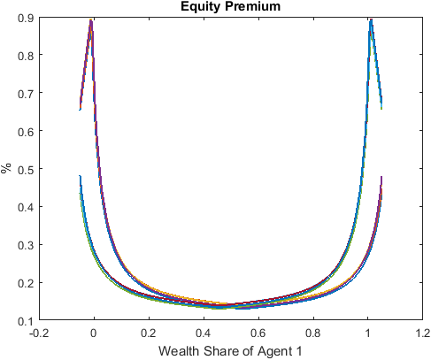
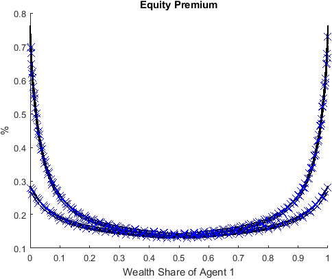

******************************************************************
Heaton and Lucas (1996): Incomplete Markets with Portfolio Choices
******************************************************************

The benchmark model in `Heaton and Lucas (1996) <https://www.journals.uchicago.edu/doi/10.1086/262030>`_ is a good starting point to
demonstrate the power of the current framework in dealing with endogenous state variables with implicit law of motions. 
The model encompasses many ingredients that appear in recent macroeconomic studies, such as
incomplete markets, portfolio choices, occasionally binding constraint, non-stationary shock process, and asset pricing with non-trivial market-clearing conditions.
We show how the model can be solved with wealth share or consumption share as the endogenous state, the two prominent approaches in the literature, and naturally fit in our toolbox framework.

===============
The Model
===============

This is an incomplete-markets model with two representative agents :math:`i\in\mathcal{I}=\{1,2\}` who trade in equity shares and bonds. 
The aggregate state :math:`z\in\boldsymbol{Z}`, which consists of capital income share, agents' income share, and aggregate endowment growth, 
follows a first-order Markov process. :math:`p_{t}^{s}(z^t)` and :math:`p_{t}^{b}(z^t)`
denote share price and bond price at time :math:`t` and in shock history :math:`z^t=\{z_0,z_1,\dots,z_t\}`. To simplify the notations, we omit the explicit dependence on shock history. 

Agent :math:`i` takes the share and bond prices as given and maximizes her inter-temporal expected utility

.. math::
    \mathcal{U}_{t}^{i}=\mathbb{E}_{t}\left[\sum_{\tau=0}^{\infty}\beta^{\tau}\frac{\left(c_{t+\tau}^{i}\right)^{1-\gamma}}{1-\gamma}\right]

subject to 

.. math::
    c_{t}^{i}+p_{t}^{s}s_{t+1}^{i}+p_{t}^{b}b_{t+1}^{i}\leq(p_{t}^{s}+d_{t})s_{t}^{i}+b_{t}^{i}+Y_{t}^{i}

and

.. math::
    s_{t+1}^{i} & \geq0\\
    b_{t+1}^{i} & \geq K^b_t,

where :math:`Y_t` denotes the aggregate income. :math:`d_t = \delta_t Y^a_t` is total dividend (capital income) and 
:math:`Y^i_t = \eta^i_t Y^a_t` is labor income of agent :math:`i`. 
Aggregate income grows at a stochastic rate :math:`\gamma_t = \frac{Y^a_t}{Y^a_{t-1}}`. :math:`z_t = \{\gamma^a_t,\delta_t,\eta^1_t\}`
follows a first-order Markov process estimated using U.S. data. The borrowing limit is set to be a constant fraction of per capita income, i.e., 
:math:`K^b_t = \bar{K}^b Y_t`.

In equilibrium, prices are determined such that markets clear in each
shock history:

.. math::
    & s_{t}^{1}+s_{t}^{2}=1,\\
    & b_{t}^{1}+b_{t}^{2}=0.

We use the normalized financial wealth share

.. math::
    \omega_{t}^{i}=\frac{(p_{t}^{s}+d_{t})s_{t}^{i}+b_{t}^{i}}{p_{t}^{s}+d_{t}}

as an endogenous state variable. In equilibrium, the market clearing conditions imply that :math:`\omega^1_t + \omega^2_t = 1`.

For any variable :math:`x_t`, 
let :math:`\hat{x}_t` denote the normalized variable: :math:`\hat{x}_t=\frac{x_t}{Y_t}` 
(except :math:`b^i_t` for which :math:`\hat{b}^i_t = \frac{b^i_t}{Y^a_{t-1}}`). Using this normalization, agent i's budget constraint can be rewritten as

.. math::
    \hat{c}_{t}^{i}+\hat{p}_{t}^{s}s_{t+1}^{i}+p_{t}^{b}\hat{b}_{t+1}^{i}\leq\left(\hat{p}_{t}^{s}+\hat{d}_{t}\right)\omega_{t}^{i}+\hat{Y}_{t}^{i}.

The wealth share is rewritten as 

.. math::
    \omega_{t}^{i}=\frac{(\hat{p}_{t}^{s}+\hat{d}_{t})s_{t}^{i}+\frac{\hat{b}_{t}^{i}}{\gamma^a_t}}{\hat{p}_{t}^{s}+\hat{d}_{t}}.

The optimality of agent i's consumption and asset choices are captured by 
first-order conditions in :math:`s^i_{t+1}` and :math:`b^i_{t+1}`:

.. math::
    1& =\beta\mathbb{E}_{t}\left[\left(\frac{\hat{c}_{t+1}^{i}}{\hat{c}^i_t}\right)^{-\gamma}\left(\gamma_{t+1}^{a}\right)^{1-\gamma}\frac{\hat{p}_{t+1}^{s}+\hat{d}_{t+1}}{\hat{p}_{t}^{s}}\right]+\hat{\mu}^{i,s}_t\\
    1& =\beta\mathbb{E}_{t}\left[\left(\frac{\hat{c}_{t+1}^{i}}{c^i_t}\right)^{-\gamma}\left(\gamma_{t+1}^{a}\right)^{-\gamma}\frac{1}{p_{t}^{b}}\right]+\hat{\mu}^{i,b}_t,

where :math:`\hat{\mu}^{i,s}_t` and :math:`\mu^{i,b}_t` are the Lagrangian multipliers on agent i's no short sale constraint and borrowing constraint, respectively.
The multipliers and portfolio choices satisfy the complementary-slackness conditions: 

.. math::
    0 & =  \hat{\mu}^{i,s}_t s^i_t\\
    0 & = \hat{\mu}^{i,b}_t (\hat{b}^i_t + \bar{K}^b).

================================
Wealth Share as Endogenous State
================================

We define a recursive equilibrium with the wealth share :math:`\omega_t` defined before. A recursive equilibrium is
:math:`\hat{c}^i(z,\omega), {s^i}', {\hat{b}^i}', \hat{\mu}^{i,s}, \hat{\mu}^{b,i}, p^s, p^b, \omega'(z';z,\omega)` that satisfy the  where agents' optimization conditions
and market clearing conditions stated above.

We omit the explicit dependence on state :math:`(z,\omega)` except the first variable, and highlight that the
state transition function :math:`\omega'` characterizes the implicit law of motion that should hold for each of the future exogenous state :math:`z'`.
It should be clear at this moment that the key feature of our framework that enables to cast the equilibrium system as a single equation system,
despite the non-trivial state-transition functions, is to include the implicit transition :math:`\omega'(z')` for each :math:`z'` as unknowns.

The system can be implemented by the following :download:`HL1996.gmod <HL1996.gmod>` code

.. literalinclude:: HL1996.gmod
    :linenos:
    :language: GDSGE

As can be seen, the implicit law of motion is captured by the consistency equation

.. literalinclude:: HL1996.gmod
    :lines: 72-72
    :lineno-start: 72
    :language: GDSGE

which says that the induced :math:`\omega'` by current decisions of stock and bond holdings should be consistent with the
unknowns for each of the future exogenous states state by state. Notice the unknowns :math:`omega'` are input into 
state transition functions to forecast future consumption and prices, which are required to formulate the recursive system, in 

.. literalinclude:: HL1996.gmod
    :lines: 58-58
    :lineno-start: 58
    :language: GDSGE

Accordingly, :math:`\omega'` is declared to a be a vector of unknowns in 

.. literalinclude:: HL1996.gmod
    :lines: 28-28
    :lineno-start: 28
    :language: GDSGE

and the consistency equations are declared to be part of the equation system in

.. literalinclude:: HL1996.gmod
    :lines: 87-87
    :lineno-start: 87
    :language: GDSGE

Since now the transition of endogenous state involves realizations of future exogenous states,
in the simulation, we need to specify the transition depends on future realization like

.. literalinclude:: HL1996.gmod
    :lines: 97-97
    :lineno-start: 97
    :language: GDSGE

Notice the prime operator in *w1n'*, which is the syntax to specify the transition's dependence on the 
realization of future exogenous states (recall, *w1n* is a vector solved as part of the *var_policy*).

Now we discuss several tricks that facilitate casting the recursive system to the toolbox, which are commonly
used for this class of problems.

Since the original problem's borrowing constraint is a fraction of the total endowments, we can always transform
the unknown to respect a box constraint like 

.. literalinclude:: HL1996.gmod
    :lines: 65-66
    :lineno-start: 65
    :language: GDSGE

where *Kb* is the parameter governing the  borrowing constraint in fraction of endowment (:math:`b^i \geq -Kb * Y^a`), and *nb1p* is the unknown defined as
:math:`nb^i=\hat{b}^i+Kb`, which ensures to :math:`nb^i` to be positive. Such transformation
remains trivial in the current problem, but becomes crucial when the borrowing constraint depends on an asset price, which makes the constraint
not necessarily  a boxed constraint. See example Cao and Nie (2017), which provides a global solution to the Kiyotaki-Moore model, where
the borrowing constraint is tied to the price of an asset in fixed supply.

Some utility functions of the toolbox are used in this example.

.. literalinclude:: HL1996.gmod
    :lines: 58-58
    :lineno-start: 58
    :language: GDSGE

*GNDSGE_INTERP_VEC* is an utility function that evaluates function approximations for implicit state transition functions 
defined in *var_interp* once for all. The results are returned in the order of variables defined in *var_interp*.
The prime operator following *GNDSGE_INTERP_VEC* indicates that the approximation is done for each of the exogenous states.
Accordingly, the returned values are vectors (of length 8 in the current example) corresponding to each of the exogenous states.
This step can be replaced by

.. code-block:: GDSGE

    psn' = ps_future'(w1n');
    pbn' = pb_future'(w1n');
    c1n' = c1_future'(w1n');
    c2n' = c2_future'(w1n');

however, at a lower speed since *GNDSGE_INTERP_VEC* evaluate function approximations with vectorization. (This is particular relevant
when using the adaptive sparse grid method as the coefficients are stored in a table with each entry represents
the coefficients across all vector dimension. Therefore, using *GNDSGE_INTERP_VEC* instead of individual evaluations
not only enables vectorization but also allows searching the hash table only once). *GNDSGE_INTERP_VEC* can be also used to skip
certain variables in *var_interp* when some of them are not necessary, and can be used without the prime operator but 
explicitly specifying the exogenous state that the approximation should be evaluated. This is particularly relevant when
expectation can be calculated before evaluating the equation system, so the evaluation is conditional on the current state.
See the :ref:`Toolbox API` for details.

After the gmod file is parsed and compiled by a local or remote compiler, first call the iter file in matlab, which produces
results like following:

.. code-block:: text

    >> IterRslt = iter_HL1996;
    Iter:10, Metric:0.133835, maxF:7.07521e-09
    Elapsed time is 8.338626 seconds.
    
    ...
    
    Iter:209, Metric:9.56568e-07, maxF:8.69762e-09
    Elapsed time is 0.443740 seconds.

We can inspect the policy functions (e.g., for the equity premium defined in Line 74 and included in *var_output* in Line 54):

.. code-block:: text

    >> figure;
    plot(IterRslt_wealth.var_state.w1, IterRslt_wealth.var_aux.equity_premium*100,'LineWidth',1.5);
    title('Equity Premium');
    xlabel('Wealth Share of Agent 1');
    ylabel('%');

which produces 

The policy functions demonstrate the non-linear and non-monotone property of the model. These non-linear regions appear with
positive probability in the model's ergodic set as shown below.

We can simulate the model using the converged policy functions contained in *IterRslt*:

.. code-block:: text

    >> SimuRslt = simulate_HL1996(IterRslt);
    Periods: 1000
    shock      w1      c1      c2      ps      pbequity_premium
        1  0.7878  0.6058  0.5344    2.48  0.93240.001541

    ...

    Periods: 50000
    shock      w1      c1      c2      ps      pbequity_premium
        6  0.8655  0.6628  0.4809   2.586  0.92510.002241

And inspect the simulation results:

.. code-block:: text

    >> figure;
    histogram(SimuRslt.w1(:,10000:end),50,'Normalization','probability');
    title('Histogram of Wealth Share in the Ergodic Distribution');
    xlabel('Wealth Share of Agent 1');
    ylabel('Fractions');

which produces

.. image:: figures/histogram_w1.png
    :scale: 40 %

The spikes in the ergodic distribution of wealth share at the two ends implies the occasionally binding
borrowing constraints.

=====================================
Consumption Share as Endogenous State
=====================================

The model can be solved using consumption share as the endogenous state. This is enabled by noticing the budget constraint

.. math::

    \hat{c}_{t+1}^i=s_{t+1}^i (\hat{p}_{t+1}^s + \hat{d}_{t+1})+ \frac{\hat{b}_{t+1}^i  }{g_{t+1}}+ 
    \underbrace{\eta_{t+1}^i - \hat{p}_{t+1}^s s_{t+2}^i-p_{t+1}^b \hat{b}_{t+2}^i}_{\text{Financial Wealth}_{t+1}}

is a natural consistency equation for the transition of consumption share :math:`\hat{c}^1`. Specifically, with consumption share,
the recursive equilibrium can be defined as :math:`{s^i}'(z,\hat{c}^1),(\hat{b}^i)', \hat{p}^s,p^b, {\hat{c}^1}'(z';z,\hat{c}^1)` such that

.. math::

    -1+\beta  \mathbb{E}_t 
    \Big[\gamma^{1-\gamma}_{t+1}\frac{[\hat{c}_{t+1}^i]^{-\gamma}}{[\hat{c}_t^i]^{-\gamma} }  \frac{\hat{p}_{t+1}^s + \hat{d}_{t+1}}{\hat{p}_t^s}] + \hat{\mu}^{i,s}_t=0, \forall i=1,2
    \\
    -1+\beta  \mathbb{E}_t 
    \Big[\gamma_{t+1}^{-\gamma}\frac{[\hat{c}_{t+1}^i]^{-\gamma}}{[\hat{c}_t^i]^{-\gamma} }  \frac{1}{{p}_t^b}\Big] + \hat{\mu}^{i,b}_t=0, \forall i=1,2
    \\
    \hat{b}_{t+1}^1+\hat{b}_{t+1}^2=0
    \\
    s_{t+1}^1+s_{t+1}^2=1
    \\
    \hat{c}^1_{t+1}=s_{t+1}^i (\hat{p}_{t+1}^s + \hat{d}_{t+1})+ \frac{\hat{b}_{t+1}^i  }{\gamma_{t+1}}+ 
    \underbrace{\eta_{t+1}^i - \hat{p}_{t+1}^s s_{t+2}^i-p_{t+1}^b \hat{b}_{t+2}^i}_{\text{Financial Wealth}_{t+1}}, \forall z_{t+1}

where :math:`\hat{c}^2` (and :math:`(\hat{c}^2)'`) can be trivially backed out by the goods market clearing condition :math:`\hat{c}^1+\hat{c}^2=1 +\hat{d}`, and does 
do not need to be defined as extra unknowns when evaluating the equation system.  The "Financial Wealth" is a function of future endogenous states, and can be part of the implicit
state transition functions.

The gmod file that implements the recursive system is (:download:`HL1996.gmod <HL1996_consumption_share.gmod>`)

.. literalinclude:: HL1996_consumption_share.gmod
    :linenos:
    :language: GDSGE

As shown, compared to the one with wealth share as the endogenous state, 
the new implementation is made possible by declaring :math:`(\hat{c}_1)'(z')` by *c1n* in 

.. literalinclude:: HL1996_consumption_share.gmod
    :lines: 28-28
    :lineno-start: 28
    :language: GDSGE

by defining the "Financial Wealth" by *flow* as *var_interp*

.. literalinclude:: HL1996_consumption_share.gmod
    :lines: 42-42
    :lineno-start: 42
    :language: GDSGE

by defining the consistency equations for :math:`\hat{c}_1` in 

.. literalinclude:: HL1996_consumption_share.gmod
    :lines: 72-72
    :lineno-start: 72
    :language: GDSGE

and including them as part of the equation system.

Finally we compare the solutions solved with wealth share as the endogenous state and consumption share as the endogenous state. 
This can be done by projecting the solutions to the same endogenous state. For example

.. literalinclude:: HL1996_consumption_share.gmod
    :lines: 74-74
    :lineno-start: 74
    :language: GDSGE

constructs the wealth share from the budget constraint following the definition.

As shown, the two solutions (solid lines for wealth share as endogenous state and markers "X" for consumption share as endogenous state) are not visually
distinguishable.

=====================
What's Next?
=====================

Through this simple example, you understand the power of the toolbox and all the essential ingredients to solve
a modern macro model.

For the time-iteration algorithm to work robustly, a crucial step is to define the starting point of the iteration 
properly. A candidate that delivers good theoretical property and proves to be numerically stable is to start from a last-period problem,
so the algorithm can be viewed as taking the limit of the solution from finite-horizon iterations.

The last-period problem has been so far trivial in the :ref:`RBC model <Getting Started - A Simple RBC Model>` and `Heaton and Lucas (1996) <https://www.journals.uchicago.edu/doi/10.1086/262030>`_ examples, but turns out to be more complex
and requires to define a different system of equations than the main *model;* block. Also, at the boundary of the state space, 
the system may feature a different system of equations, and such boundary conditions turn out to be necessary to solve 
many models robustly. To see how these issues are addressed very conveniently in the toolbox, see example Cao and Nie (2017).

Or you can directly proceed to :ref:`the toolbox's API <Toolbox API>`.