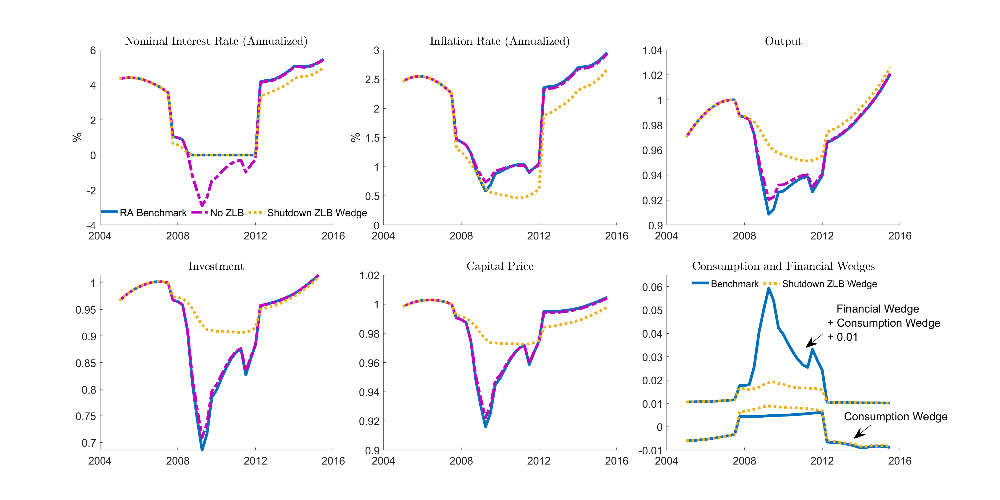

**************************************************************************************
A New-Keynesian Model with an Occasionally Binding Interest Rate Zero Lower Bound
**************************************************************************************

.. _zlb:
===============
The Model
===============

One important class of models featuring non-trivial non-linearity is the New-Keynesian model with an occasionally binding interest rate zero lower bound (ZLB).
The Great Recession and recent COVID-19 have made the ZLB a relevant policy constraint for major countries in the world. The binding ZLB has been shown to exacerbate a typical crisis (see e.g., Eggertsson
and Woodford (2003), Coibion et al. (2012), Gust et al. (2017), Eggertsson and Krugman (2012) and Guerrieri and
Lorenzoni (2017) among many), especially in a financial crisis due to its interaction with the asset price deflation vicious cycle (Cao, Luo and Nie 2021).

This example guides to you solve a model of such kind, and assess the effect of a binding ZLB in exacerbating a recession. The model is the representative-agent version of Cao, Luo and Nie (2021). It is a production economy with a Markov shock to productivity. Following the New-Keynesian literature (Smets and Wouters (2007), Christiano et al. (2015), etc.) the model assumes exogenous financial and consumption wedges that enter the agent's Euler equations. These wedges follow their own exogenous Markov processes. It is shocks to these wedges that drive a binding ZLB in the model. One important lesson from Cao, Luo and Nie (2021) is that these wedges should be regarded as the consequences rather than the causes of the binding ZLB. We will return to this point after we present the solutions to this simple representative-agent model.

The representative households' preference is

.. math::
    \mathbb{E}_0 \sum_{t=0}^{\infty} \beta^{t}\left[\log c_{t}-\frac{1}{\eta}L_{t}^{\eta}\right],
    
where :math:`c_t` is consumption and :math:`L_t` is the labor supply.
The budget constraint reads

.. math::
    P_{t} c_{t}+P_{t} \frac{1}{1-\Delta_{t}^{k}} q_{t}^{K^{\prime}} k_{t+1}+\frac{1}{1+\Delta_{t}^{b}} \frac{B_{t}}{R_{t}} \leq B_{t-1}+P_{t}\left(r_{t}^{K}+q_{t}^{K}\right) k_{t}+P_{t} w_{t} L_{t}+P_{t} \int_{0}^{1} \Xi_{t}(z) d z,
    
where  :math:`P_{t}` is the price level, :math:`R_{t}` is the bond nominal interest rate, :math:`r_{t}^{K}` is the real return on capital, :math:`q_{t}^{K'}` and :math:`q_{t}^{K}` are the market prices for new and existing capital that are competitively determined, :math:`w_{t}` is the real wage, and :math:`\int_{0}^{1}\Xi_{t}(z)dz` is the profits transferred from the retailers in real terms. The terms :math:`\Delta_{t}^{b}` and :math:`\Delta_{t}^{k}` are exogenous wedges and will enter as errors into the Euler equations for bond and capital holdings. The Euler equations for bond and capital holdings are respectively

.. math::
    1=(1+\Delta_{t}^{b})\mathbb{E}_{t}\left[\frac{\mathcal{M}_{t+1}}{\mathcal{M}_{t}}\frac{R_{t}}{\pi_{t+1}}\right],
    \\
    1=(1-\Delta_{t}^{k})\mathbb{E}_{t}\left[\frac{\mathcal{M}_{t+1}}{\mathcal{M}_{t}}\frac{r_{t+1}^{K}+q_{t+1}^{K}}{q_{t}^{K'}}\right],

where :math:`\frac{\mathcal{M}_{t+1}}{\mathcal{M}_{t}}\equiv \beta  \frac{1/c_{t+1}}{1/c_t}`.

We introduce capital adjustment costs as follows. There is a representative capital producing firm producing new capital using exiting capital. The cost of producing :math:`k_t^I` units of new capital with :math:`k_t^o` units of existing capital is determined by

.. math::
    \Omega(k_{t}^{o},k_{t}^{I})=k_{t}^{I}-(1-\delta)k_{t}^{o}+\frac{\xi}{2}\frac{(k_{t}^{I}-k_{t}^{o})^{2}}{k_{t}^{o}}.
    
This leads to the equilibrium prices of existing and new capital following the first order conditions of the representative capital producing firm:

.. math::
    q_{t}^{K'}=\Omega_{2}(k_{t}^{o},k_{t}^{I}),\quad q_{t}^{K}=-\Omega_{1}(k_{t}^{o},k_{t}^{I}).
    

One important result from Cao, Luo and Nie (2021) is that even in a canonical representative-agent NK model of the kind presented here, when there is an occasionally binding ZLB, a moderate level of capital adjustment costs is required for the equilibrium to exist. In particular, in the two-period version of the model, the authors show that the equilibrium simply does not exist if the capital level is too high. The intuition behind this non-existence result is that when the ZLB binds, it binds the return to investment from below, since by the Euler equations of bonds and capital, the returns to these two assets should be roughly equalized (in the two-period version of the model when there is no uncertainty, this statement is exact). Therefore, a high level of capital would leave the future MPK, and thus the return to capital too low; without an extra margin for the current capital price to adjust, it is impossible for the goods market to clear. This intuitive argument should be formalized by also combining the consumption behavior at the ZLB (see Cao, Luo and Nie 2021, Proposition 1 for equilibrium non-existence without capital adjustment costs and Proposition 2 for equilibrium existence after introducing capital adjustment costs). Nevertheless, this intuition highlights the potentially important interaction between the ZLB and the capital price---it articulates a new return-equalization channel via which the binding ZLB may depress the capital price, which is shown to be even more important when the capital price enters a borrowing constraint, as in Cao, Luo and Nie (2021).

The rest of the model is standard. The production of intermediate goods follows a Cobb-Douglas production function:

.. math::
    Y_t^e = k_t^{\alpha}(A_t L_t)^{1-\alpha}.

Intermediate goods are first differentiated by retailers before being aggregated into final goods by a CES aggregator. Retailers engage in monopolistic competition. The nominal rigidity is introduced by assuming retailers producing differentiated goods being subject to price adjustment costs. This generates the standard New-Keynesian Phillips Curve in its non-linear form:

.. math::
    (1+\pi_{t})\phi'(\pi_{t})=\frac{\varepsilon}{\theta}\left(\frac{1}{X_{t}}-\frac{\varepsilon-1}{\varepsilon}\right)+\mathbb{E}_{t}\left[(1+\pi_{t+1})\phi'(\pi_{t+1})\frac{\mathcal{M}_{t+1}}{\mathcal{M}_{t}}\frac{Y_{t+1}}{Y_{t}}\right],
    
where :math:`\phi(\cdot)` is a convex cost function that takes argument the net inflation :math:`\pi_t`, and :math:`X_t` is the markup charged by the retailers over the marginal cost of production.
Finally, the monetary policy implements the Taylor rule subject to the ZLB constraint:

.. math::
    R_{t}=\max\left\{ \bar{R}\left(\frac{1+\pi_{t}}{1+\bar{\pi}}\right)^{\phi_{\pi}}\left(\frac{Y_{t}}{\bar{Y}}\right)^{\phi_{Y}},1\right\}.
    

*Equilibrium*: Given the stochastic processes :math:`\{A_t, \Delta_t^{k},\Delta_t^b\}` and initial capital :math:`k_0`, A sequential competitive equilibrium is a stochastic sequence of
:math:`\{ c_t, k_{t+1}, L_t,Y_t, X_t, R_t,\pi_t,w_t, r_t^K, q_t^K, q_t^{K'}\}_{t=0}^{\infty}` such that

.. math::
    Y_t = k_t^{\alpha}(A_tL_t)^{1-\alpha},
    \\
    c_t + \Phi_t+\Omega_t = Y_t,
    \\
    L_t^{\eta-1} = \frac{1}{c_t} w_t,
    \\
    w_t =(1-\alpha)\frac{1}{X_t} k_t^{\alpha}A_t^{1-\alpha}L_t^{-\alpha},
    \\
    r_t^K=\alpha\frac{1}{X_t} k_t^{\alpha-1}A_t^{1-\alpha}L_t^{1-\alpha},
    \\
    (1+\pi_{t})\phi'(\pi_{t})=\frac{\varepsilon}{\theta}\left(\frac{1}{X_{t}}-\frac{\varepsilon-1}{\varepsilon}\right)+\mathbb{E}_{t}\left[(1+\pi_{t+1})\phi'(\pi_{t+1})\frac{\mathcal{M}_{t+1}}{\mathcal{M}_{t}}\frac{Y_{t+1}}{Y_{t}}\right],
    \\
    R_{t}=\max\left\{ \bar{R}\left(\frac{1+\pi_{t}}{1+\bar{\pi}}\right)^{\phi_{\pi}}\left(\frac{Y_{t}}{\bar{Y}}\right)^{\phi_{Y}},1\right\},
    \\
    q_{t}^{K'}=\Omega_{2}(k_{t}^{o},k_{t}^{I}),
    \\
    \quad q_{t}^{K}=-\Omega_{1}(k_{t}^{o},k_{t}^{I}),
    \\
    1=(1+\Delta_{t}^{b})\mathbb{E}_{t}\left[\frac{\mathcal{M}_{t+1}}{\mathcal{M}_{t}}\frac{R_{t}}{\pi_{t+1}}\right],
    \\

    1=(1-\Delta_{t}^{k})\mathbb{E}_{t}\left[\frac{\mathcal{M}_{t+1}}{\mathcal{M}_{t}}\frac{r_{t+1}^{K}+q_{t+1}^{K}}{q_{t}^{K'}}\right].

=====================
Parameterization
=====================

We assume the growth of :math:`A_t`, :math:`g_t \equiv \frac{A_t}{A_{t-1}}-1`, follows an AR(1) process, and use the estimated process from Fernald (2014). We parameterize the processes of :math:`\Delta_t^b` and :math:`\Delta_t^k` as AR(1), and estimate them using the simulated time series from the full model in Cao, Luo and Nie (2021). The full model augments the current one with financially constrained intermediate-good producers and an occasionally binding collateral constraint. The way of parameterizing the processes of wedges is to mimic the NK literature in inferring wedges from the data with a representative-agent model. However, through the full structural model we understand the exact sources of these wedges---in particular, part of them are a consequence of the binding ZLB.

We parameterize the price adjustment cost function as follows:

.. math::
    \phi(\pi)=\frac{\pi-\bar{\pi}}{\sqrt{\bar{\pi}-\underline{\pi}}}-2\sqrt{\pi-\underline{\pi}}+2\sqrt{\bar{\pi}-\underline{\pi}},
    
where :math:`\bar{\pi}` is a level of parameter whereas :math:`\underline{\pi}` introduces extra curvature at the bottom. We show that this price adjustment function removes severe deflation in a ZLB episode (Eggertsson and Singh, 2019), which is necessary for the equilibrium to exist.

==========
Solution
==========

We solve the recursive equilibrium with policy and state transition functions defined over :math:`(A_t, \Delta_t^{k},\Delta_t^b,k_t)`. Note that since we have assumed a non-stationary productivity process, we need to detrend the system before inputting into the toolbox. We show that the system can be reduced to a system of four variables :math:`(\pi_t,X_t,k_{t+1},c_t)`. The code is a bit long so we provide the gmod file in the download link :download:`zlb_rep.gmod <zlb_rep.gmod>`. An entry file is provided (:download:`main_zlb_rep.m <main_zlb_rep.m>`) to call the toolbox-generated file as some extra procedures are required to solve the model. These procedures are: (1) one first solves the model with no ZLB constraint as a warmup, and continues from this warmup to solve the original model; (2) one also imposes a constraint on the minimum inflation rate that can be set by retailers (i.e., imposing :math:`\pi_t \geq \underline{\underline{\pi}}`,  for some :math:`\underline{\underline{\pi}}` in the warmup). These temporary constraints will not affect the final solution, but turn out to make solving the model more robustly.

The policy iterations finish in 10 minutes on a regular desktop (with a 12-core 2.5GHz CPU). With the solved policy functions, one can simulate the model and inspect the property of the model's ergodic set, such as its business cycle properties and the histogram of the ZLB duration. Here instead we focus on one episode drawn from the model's ergodic set, motivated by the 2008 Great Recession. The way we draw the episode is to start with an initial capital level that is the same as in the data, and then feed in the realizations of productivity growth shocks as estimated by Fernald (2014), and the realizations of the two wedges estimated from the same episode generated from the full structural model of Cao, Nie and Luo (2021). In doing this, the two wedges are what the econometrician would estimate if they treat the time-series data generated from the structural model as generated by the current representative-agent model with reduced-form wedges. After the wedges are fed in, the representative-agent model would produce the same dynamics as the full structural model.  These benchmark dynamics are represented in the figure below by the blue curves labeled as ``RA Benchmark''.

As shown, the time series generated by the model successfully replicates the key properties of several macro variables during this episode: the interest rate falls to the ZLB, the output, investment, asset price all drop sharply, and the drop in inflation is mild. The bottom right panel plots the time series of the two wedges that are fed in, and is clear about what drives the ZLB: there is a sharp increase in the financial wedge :math:`\Delta_t^k`---the exogenous return difference in capital and bond returns, which requires the bond return to be low in equilibrium.

Note that this sharp rise in the financial wedge is assumed to be orthogonal to the ZLB by the nature of the exercise here, but  arises as a consequence of the binding ZLB in the full structural model, since the binding ZLB would lead to an asset price drop which tightens the entrepreneur's borrowing constraint and reduces their demand for capital in the full model. Thus, an interesting counter-factual question is that, if we remove the movement in the financial wedge that should be attributed to the binding ZLB, what are the remaining dynamics. The answer to this counter-factual question is described by the yellow curves in the figure labeled as ``Shutdown ZLB wedge''. As shown, after the rise in the financial wedge that is due to the binding ZLB is removed, all responses of the macro variables are much milder, suggesting that the majority of the effect of the binding ZLB is actually through its impact on the financial wedges.

Note that if we simply remove the ZLB but treat the financial wedges as exogenous, following a decomposition exercise in e.g.,  Christiano et al. (2015), we would substantially underestimate the impact of the ZLB, as shown by the purple curves in the figure. These echo the findings in Christiano et al. (2015)
that the ZLB is not important, once the changes in the financial wedges are taken into account, which, as we stress here and in the paper, are subject to Lucas' critique by ignoring the endogeneity of the financial wedges. 

The code for simulating the crisis episode, for simulating the ergodic set, and the toolbox code for solving the full structural model can be found at the paper's replication package at AEA as a companion to the published paper (webpage to be posted after the proof of the package by the AEA data editor).
